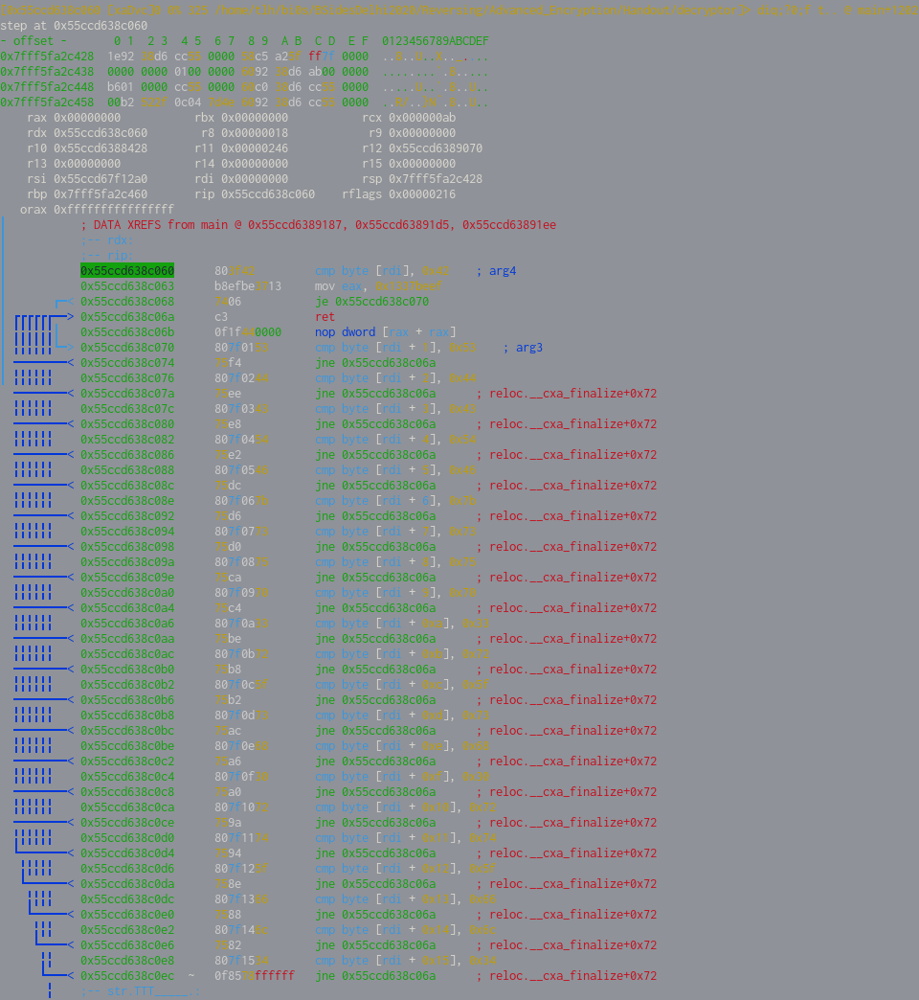

 
# Writeup

The entire point of the challenge was to bruteforce the PIN for which the challenge will run and exit successfully.

This challenge already has a good writeup [here](https://medium.com/@ret2ex/writeup-reverse-engineering-bsides-delhi-ctf-2020-8a3f8bc92fb), so I'll essentially be repeating what he said. 

One thing to note before bruteforcing: 
- This chall takes input from _both_ `stdin` and `argv`, so it's a good idea to put junk values in for the parameters.

```python3
from pwn import *

for i in range(0xff):
    r = process(["./decryptor","blahblah"])
    r.sendline(str(i))

    try:
        stuff = r.recv()
    except:
        r.close()
        continue
    print(str(i)+":",r.poll())
```

Using this, we can search for possible solutions. 
This gives us 133, 170, 171 and 232 as possible solutions.

Trying out these four inputs, we can see that only `171` gives simple-looking assembly.



It's pretty trivial as to what the flag is from here. This function is doing a simple check and all we need to do is to interpret the hex values as ASCII.

The flag is "BSDCTF{sup3r_sh0rt_fl4g}"
