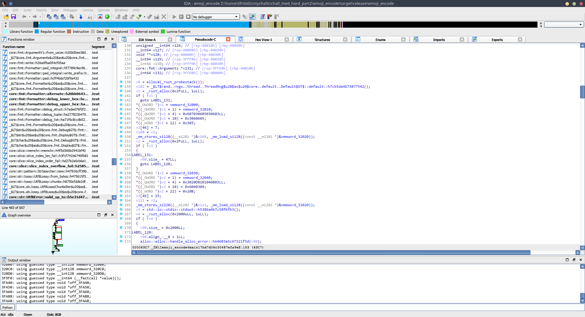

# Writeup

The entire point of this challenge was to get the two arrays that are defined in the `xmmword` instructions in here. From them on, it's the same as Bit Level h4xx0r.



This is how it looks, decompiled. If you weren't able to get the decompiled output from IDA, Use Alt+P to edit the function, check "Far function", and decompile again. 

Let's get into the arrays themselves.

```c
v1 = _rust_alloc(0x2FuLL, 1uLL);
  *(_OWORD *)v1 = xmmword_32000;
  *((_OWORD *)v1 + 1) = xmmword_32010;
  *((_QWORD *)v1 + 4) = 0x607030605030603LL;
  *((_DWORD *)v1 + 10) = 0x3060605;
  *((_WORD *)v1 + 22) = 0x303;
  v1[46] = 7;
  v108 = v1;
```

This is how the first array was initialized, sans error handling (i.e. the LABEL_131 part). Here we have two `xmmwords` being used to define some constants as well. The rust equivalent to this part is 

```rust
 let flag_up = vec![4, 5, 4, 4, 5, 4, 7, 3, 5, 7, 3, 6, 7, 3, 6, 5, 7, 3, 5, 7, 7, 7, 5, 3, 7, 5, 6, 3, 3, 3, 7, 5, 3, 6, 3, 5, 6, 3, 7, 6, 5, 6, 6, 3, 3, 3, 7];
```

Similarly, the next one is:

```rust
let flag_low = vec![7, 4, 14, 4, 3, 4, 15, 4, 0, 15, 0, 5, 4, 15, 4, 4, 15, 12, 3, 4, 5, 4, 15, 0, 14, 3, 15, 8, 4, 2, 4, 15, 3, 8, 4, 1, 1, 13, 2, 3, 4, 3, 4, 6, 11, 1, 15];
```

The important parts of this chall is done.

The rest of this chall shuffles flag_low around, and then encodes it into emoji. 

```c
      v79 = v108;
      for ( i = 0LL; i != v79; ++i )
      {
        *((_WORD *)&output + 2 * i) = 0x9ff0;
        *((_BYTE *)&output + 4 * i + 2) = (*((_BYTE *)&iter->data_ptr + i) >> 6) - 113;
        *((_BYTE *)&output + 4 * i + 3) = v79[(unsigned __int8)(*((_BYTE *)&flag_up->data_ptr + i)
                                                            - 47
                                                            * ((175
                                                              * (unsigned int)*((unsigned __int8 *)&v73->data_ptr + i)) >> 13))] & 0x3F | 0x80;
      }
```

This is part of the emoji encoding, tweaked to help understand. But since the encoding truncates some data, it is better to just use the above two arrays to get the flag.


Using the exploit code given here, we will get the flag. Again, the main logic is similar to that of Bit Level h4xx0r.

```python
import base64
from collections import deque


# print(flag)

flag_low = deque([7, 4, 14, 4, 3, 4, 15, 4, 0, 15, 0, 5, 4, 15, 4, 4, 15, 12, 3, 4, 5, 4, 15, 0, 14, 3, 15, 8, 4, 2, 4, 15, 3, 8, 4, 1, 1, 13, 2, 3, 4, 3, 4, 6, 11, 1, 15])

flag_up = deque([4, 5, 4, 4, 5, 4, 7, 3, 5, 7, 3, 6, 7, 3, 6, 5, 7, 3, 5, 7, 7, 7, 5, 3, 7, 5, 6, 3, 3, 3, 7, 5, 3, 6, 3, 5, 6, 3, 7, 6, 5, 6, 6, 3, 3, 3, 7])


for i in range(len(flag_low)):
    temp_low = flag_low.copy()
    temp_low.rotate(-i)
    temp = list(temp_low)
    possible_flag = ""
    for j in range(len(flag_low)):
        possible_flag += chr(flag_up[j]*16+temp[j])
    if "BSDCTF" in possible_flag:
        print(possible_flag)
```

The flag is `BSDCTF{1_w4nt3d_t0_put_4t_l345t_0n3_h4rd_ch411}`
